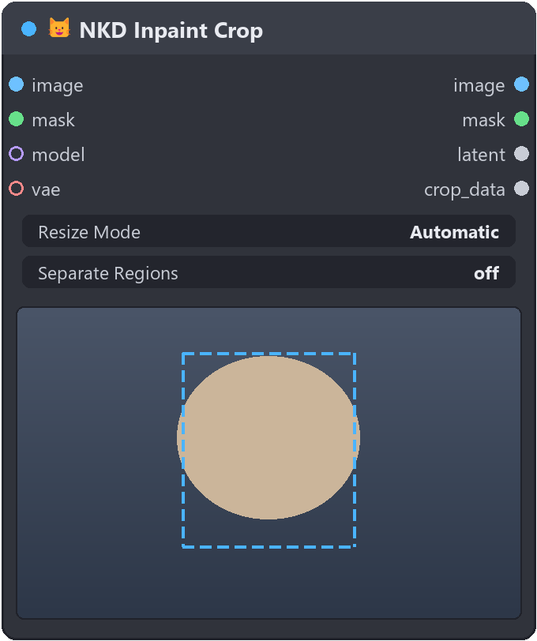
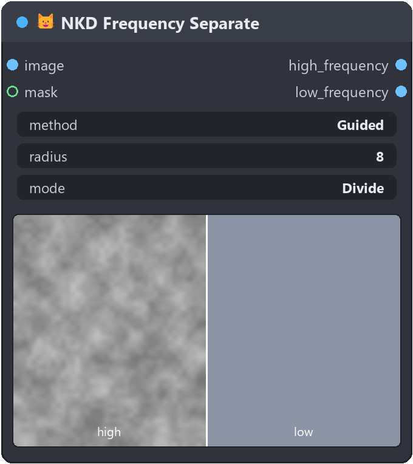
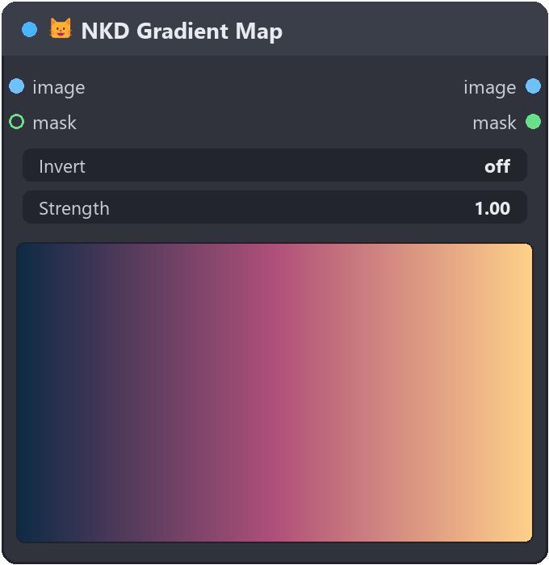
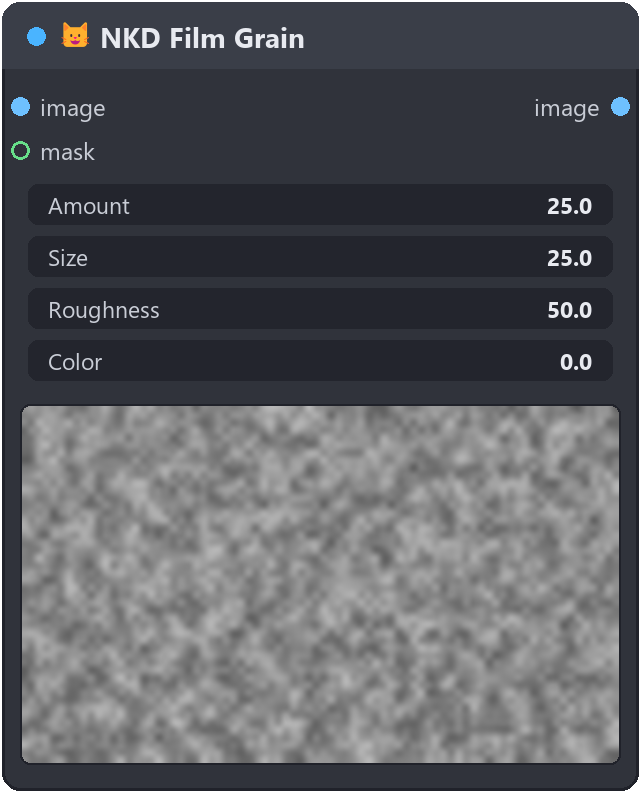
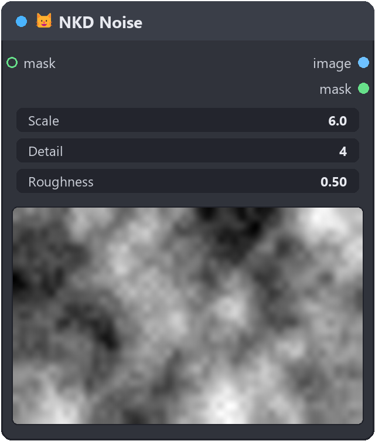
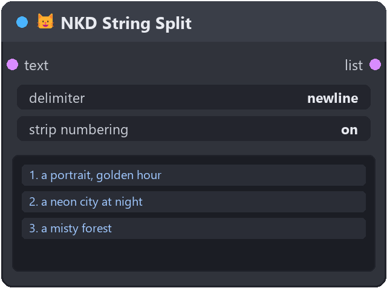
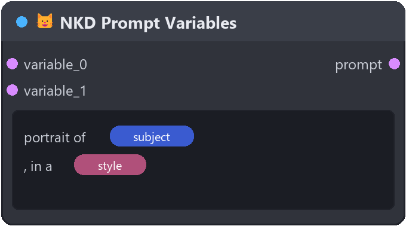

# 😺NKD Basic Tools

A grab-bag of everyday ComfyUI nodes that remove wiring and busywork: detail an
inpaint at the right resolution, transfer skin texture after a relight, recolor
by brightness, make procedural noise or film grain, and turn one text box into a
whole batch of prompts. Each node shows a **live preview in the node itself**, so
you tune it while you look at it — no separate preview node, and most update
without even running the graph.

> **Screenshots:** the `![…]` slots below point at `assets/`. Drop a PNG of each
> node there (same filename) and it shows up here — nothing else to change.

---

## Detailing & inpainting

### 😺NKD Inpaint Crop / 😺NKD Inpaint Stitch

**Use it to** fix or add detail in one part of an image without re-rendering (or
degrading) the whole thing. Crop cuts out the masked area with padding, sends it
to your sampler at its ideal resolution, and Stitch drops the result back on the
original **at full resolution** — clean edges, no drift, no visible seam.



```
Load Image ─┬─▶ 😺NKD Inpaint Crop ─▶ image/mask/latent ─▶ (your sampling pipeline)
   Mask ────┘         │                                          │
                      └──── crop_data ──▶ 😺NKD Inpaint Stitch ◀── image
                                                   │
                                                   ▼
                                          full-resolution result
```

**Crop**
- Mask cleanup built in: invert, fill holes, expand and soften in one place.
- `Resize Mode` — `Automatic` keeps the native resolution and only rescales when
  the crop is too small/large (min/max limits); `Megapixels` gives a fixed
  budget; `Longest Side` an exact size.
- Wire your `model` and `vae` (optional) and Crop hands back a prepared model and
  a ready-to-sample latent — no glue nodes between it and your sampler.
- In-node preview of the mask and crop region, with partial execution (blue play
  button) so you tune the crop without running the whole graph.

**Chained detailing (`Separate Regions`)** — turn it on and every separate blob
of the mask gets its own crop at its own resolution. Your sampler runs once per
region automatically (no extra wiring) and Stitch composites them all back in one
pass. Also takes mask batches from segmentation nodes (one region per mask).
Filter by minimum area, cap the count, choose the order.

**Stitch**
- `Feather` / `Edge Hardness` — how softly the patch blends and how well it keeps
  the original background from ghosting at the edges.
- `Match Colors` — corrects the subtle color/brightness drift models introduce,
  so the patch belongs to the same scene.
- `Seamless Edges` — extra pass for stubborn seams (needs OpenCV).

### 😺NKD Frequency Separate / 😺NKD Frequency Combine

**Use it to** retouch like a pro: split an image into a soft **base** (low
frequency) and a **detail** layer (high frequency), then recombine. The classic
job is restoring texture after a relight — take the pores/fabric detail from the
original and the lighting from the relit result, and get the relit image back
with all its micro-detail intact.



```
original ─▶ 😺NKD Frequency Separate ─┬─ high_frequency ─▶ 😺NKD Frequency Combine ─▶ result
                                      └─ (its detail)         ▲
                             relit image ───────────────── low_frequency
```

- **Four ways to build the base:** `Gaussian` (fast, classic), `Guided`
  (edge-safe, no halo), `Rolling Guidance` (erases texture by size but keeps
  shapes), `Median` (spot blemishes). `Radius` sets the detail scale.
- **`Divide` vs `Subtract`** detail mode — Divide (a ratio) is lighting-invariant,
  which is what makes detail transfer between differently-lit images clean.
- **`Luminance` detail** keeps texture achromatic, so recombining never shifts
  color; `RGB` carries chromatic detail too.
- Processes in **linear light** for correct results (toggle off for classic
  gamma). `mode` and `linear` must match between the two nodes.
- Live in-node preview with a **wipe slider** (high frequency ◄ | ► low
  frequency) so you can see exactly what each layer holds. Run its blue play
  button to preview even when the source arrives through a resize or subgraph.
- Optional `mask` output confines the detail to a region (e.g. skin only).

---

## Color & gradients

### 😺NKD Gradient Map / 😺NKD Gradient Generate

Both share one **color-ramp editor**: click the bar to add a stop, click a stop
for the native color picker, drag to move, Shift-click to remove. Save/load your
own ramps as presets.



**Gradient Map — use it to** recolor a photo by brightness (duotone, teal-orange,
any color grade): darks land on one end of the ramp, lights on the other.
`Invert` flips it, `Strength` dials it back, an optional `mask` limits where it
lands. Live preview updates as you edit the ramp — and run its play button to
preview the grade even when the image comes through a resize/subgraph.

**Gradient Generate — use it to** make a gradient image from scratch (no input
needed) as a background, mask, or ramp source — `Linear`, `Radial`, `Angular`
(conic) or `Diamond`. A Photoshop-style **on-canvas gizmo** lets you drag two
handles right on the preview to set direction, center and extent instead of
typing numbers. Feed it width/height and the gizmo adapts to that aspect ratio.

---

## Textures

### 😺NKD Film Grain

**Use it to** add believable analog grain — a Lightroom / Camera-Raw feel —
with `Amount`, `Size` and `Roughness`. Monochrome by default; raise `Color` for
dye-cloud color grain. On a **video batch** each frame gets fresh grain so it
shimmers like real emulsion instead of sitting frozen on top. Optional `mask` to
grain only part of the frame.



### 😺NKD Noise

**Use it to** generate procedural fractal noise (fBm) for clouds, fog, smoke and
organic textures — as an image **and** a mask. `Scale`, `Detail`, `Roughness`,
`Lacunarity` and `Distortion` shape it; `Frames` + `Evolution` + `Loop` make a
seamlessly looping animated sequence. Feed the output straight into Gradient Map
to tint it.



---

## Prompt & text utilities

### 😺NKD String Split

**Use it to** turn one block of text into a batch: split it into a list of
strings and downstream nodes run once per item — a list of prompts becomes N
generations with no extra wiring. Common delimiters plus a custom one, whitespace
trimming, empty-piece skipping, and optional removal of list numbering (`1.`,
`2)`, `-`) for lists an LLM wrote. Shows the resulting list in the node, with
partial execution for instant iteration.



### 😺NKD Prompt Variables

**Use it to** build a multiprompt with two nodes. Write your prompt and drop
**variable chips** into it; each chip is filled by whatever text arrives on its
input socket (sockets grow as you connect, renamed sockets rename their chips,
chips drag around the text). Wire a list — e.g. from 😺NKD String Split — into a
variable and the prompt resolves **once per item**. Shift-click a chip (or
`Randomize All`) to make that variable pick a random item instead, seeded for
reproducibility. Shows the resolved prompt(s) in the node.



---

## License

MIT
