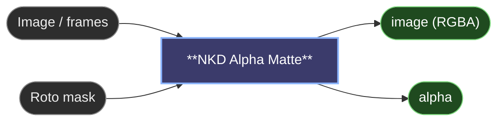

# 😺NKD Alpha Matte

Turns an image and a roto mask into a transparent cut-out. One frame or a whole
video, in one node.

The core's Join Image with Alpha reads the mask the other way round: white
becomes transparent. Give it the mask SAM made of your subject and you cut out
the subject. Here **Mask Is Subject** is on by default, so white is what you keep.
Turn it off for masks that already mean "transparent", like Load Image's.

**Decontaminate Edges** is the reason to use this over a plain join. Where the
edge is soft (hair, motion blur, defocus) the pixels are a mix of the subject and
the old background, and that background colour halos as soon as you put the
cut-out over something else. The node estimates the subject's own colour in that
band and puts it back. Fully opaque pixels are left exactly as they were. It's an
estimate (blur-fusion, Forte & Pitié 2021), so very wide soft edges keep a trace,
but most of the spill goes.

- Mask Is Subject keeps white in the mask. Off, white becomes transparent.
- Expand / Choke grows the matte, or chokes it with a negative value to drop a rim of old background.
- Feather softens the edge by that many pixels.
- Smooth In Time is for video: each frame's matte is averaged with its neighbours so the edge doesn't boil.
- Decontaminate Edges cleans the old background out of the soft edge.

The `image` output is RGBA with straight alpha. Save Image keeps the transparency;
for video, save with 😺NKD Video Viewer from [NKD Preview Tools](https://github.com/Nekodificador/ComfyUI-NKD-Preview-Tools) as ProRes 4444 or webm/vp9. The `alpha` output is
the matte that was applied, 1 = opaque.

81 frames at 1080p take about 5 s on an RTX 5090 with everything on.

---

[← All 😺NKD Basic Tools nodes](../README.md)
