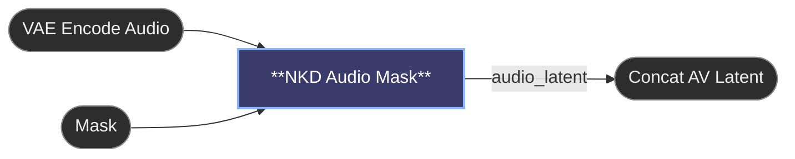

# 😺NKD Audio Mask

The audio half of [😺NKD AV Latent](av-latent.md) on its own, for when you'd
rather keep the chain out in the open. It *is* the audio branch's Set Latent
Noise Mask, latent in and the same latent out with the mask already on it, so it
replaces both that node and the Solid Mask feeding it, and the audio latent gets
wired once instead of forked.

Same retiming as **follow mask**, and it arrives already fitted to the
soundtrack, so nothing stretches it on the way into the sampler. Different models
lay their audio out differently, so the timing is read off the latent you connect
rather than assumed, and a latent it can't read gets refused with a message
instead of quietly masking the wrong thing. Tested against MiniMax H3; LTXV
should work but hasn't been run on a real clip.

It isn't a shortcut for the stock node. Hand a video mask to Set Latent Noise
Mask and the soundtrack comes back regenerated from end to end no matter what the
mask said, with no error to tell you. It reads a mask as a picture, and a
soundtrack has no picture in it.

---

[← All 😺NKD Basic Tools nodes](../README.md)
