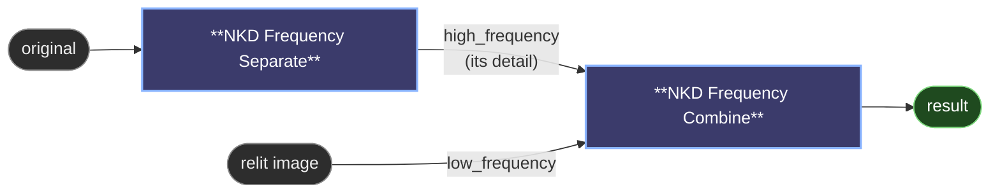

# 😺NKD Frequency Separate / 😺NKD Frequency Combine

Splits an image into a soft base (low frequency) and a detail layer (high
frequency), then puts them back together. The classic job is restoring texture
after a relight: you take the pores and the fabric from the original, the
lighting from the relit version, and get the relit image back with its
micro-detail intact.

- Four ways to build the base. `Gaussian` is the fast classic, `Guided` is
  edge-safe and won't halo, `Rolling Guidance` erases texture by size while
  keeping shapes, and `Median` is for spot blemishes. `Radius` sets the detail
  scale.
- `Divide` and `Subtract` are the two detail modes. Divide is a ratio, which
  makes it lighting-invariant, and that's what makes detail transfer between
  differently-lit images come out clean.
- `Luminance` detail keeps the texture achromatic, so recombining never shifts
  color. `RGB` carries chromatic detail as well.
- `linear` processes in linear light, which is what gives correct results. Toggle
  it off for the classic gamma behaviour.
- `mode` and `linear` have to match between the two nodes.
- The optional `mask` output confines the detail to a region, skin only for
  instance.

## Preview

The in-node preview has a wipe slider (high frequency ◄ | ► low frequency) so you
can see what each layer actually holds. Its blue play button previews even when
the source arrives through a resize or a subgraph.

The `1:1` button crops the visible area at native resolution and lets you drag it
around. It's the only way to really judge a detail layer, because a fitted view
destroys the very high frequency you're trying to look at. When the view is
fitted, `radius` is scaled to that downscale and the hint shows you the effective
value (`r8 → r2 @ 31%`), so the number in front of you matches the frequency
you're getting.

---

[← All 😺NKD Basic Tools nodes](../README.md)
