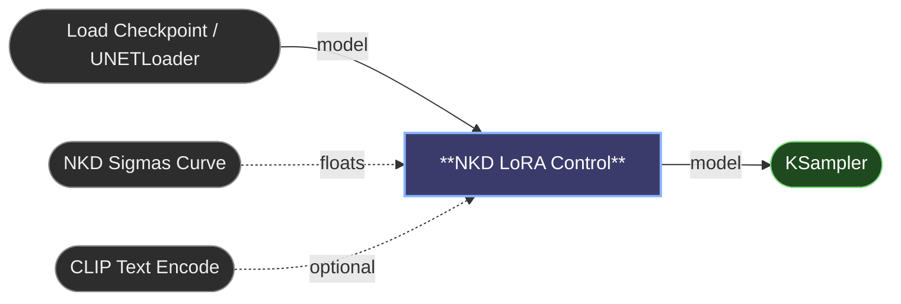

# 😺NKD LoRA Control

Loads a LoRA and shows you, block by block, how much of it each block actually
carries. From there you can mute the blocks that aren't pulling their weight,
push up the ones that are, and drive the whole thing over sampling time with a
curve.

The block list is read from the LoRA file itself, so it works on any
architecture without picking a model first: FLUX, Klein, Wan, Qwen, Krea,
MiniMax H3, SDXL, SD 1.5, and whatever ships next. Pick a LoRA and the blocks
appear right away, with no need to run the graph.

## Wiring

Without a curve it's a plain model in, model out. Connect a curve and the
`positive` and `negative` sockets appear, because that's what carries the
schedule to the sampler. Unplug the curve and they tidy themselves away, unless
you've wired them, in which case they stay put rather than taking your cables
with them.

## The block panel

Each row is one block: a checkbox, its name, a strength slider and its value.
The colour and the bar behind the name are the block's impact, cold for blocks
that barely move the image and hot for the ones carrying the LoRA. The score is
relative to the strongest block in that file, so the top block always reads 100.

- Drag down the checkbox column to switch a run of blocks on or off in one pass.
- Click a name to select a row, `Shift`-click for a range, `Ctrl`-click to add
  or remove one.
- Move a slider with rows selected and they all take the same value.
- `Ctrl` while dragging snaps to 0.25, `Shift` slows the drag to a tenth.
- Double-click a row to put it back to 1.00.
- `All on`, `All off`, `Invert` and `Reset` act on the selection, or on
  everything when nothing is selected.

Block strength runs from -1 to 2. Negative values push against what the LoRA
learned for that block.

## Impact filter

The slider under the buttons keeps every block at or above a given impact and
mutes the rest, so you can sweep it and watch the block count fall until only
the blocks that matter are left. It applies to the whole LoRA, never to a
selection. Edit a block by hand afterwards and the readout goes to `off`,
because that pattern is no longer a threshold.

## Presets

The dropdown holds two kinds of shortcut:

- **Only this group** is built from the blocks the current file has, so a FLUX
  LoRA offers its double and single blocks, and a Krea one offers what it has
  instead. Nothing is hardcoded per model.
- **Saved** is your own. `Save` names the current setup, `Delete` removes the
  selected one.

Presets travel between LoRAs. A preset names blocks, and a block the current
LoRA doesn't have is skipped, so one saved on a 38-single FLUX LoRA applies
cleanly to a 24-single Klein one. They live in your ComfyUI `user` folder and
survive updating the pack.

Fixed "high impact" presets are deliberately absent. Which blocks carry a LoRA
depends on what was trained, not on the architecture: on twelve different Klein
LoRAs, the block range another pack ships as its high-impact preset was the
strongest one in two of them. The impact filter answers that question per file
instead of guessing.

## Strength over time

`curve` takes a list of floats, one per sampling step, such as the `floats`
output of 😺NKD Sigmas Curve. The LoRA then fades in, fades out or does whatever
shape you draw, and `strength` multiplies the whole curve.

Per-block shaping and the curve are independent and multiply together, so you
can keep a block at half strength and still ramp the LoRA across the sampling
run.

Scheduling doesn't work on GGUF or fp8 models. The node detects those, applies
the LoRA at a flat strength instead of failing mid-render, and says so on a
line under the panel.

## Saving a shaped LoRA

`Save LoRA` writes the current block setup out as a normal `.safetensors` under
`models/loras/NKD/`. Any loader can then use it at strength 1.0 and this node
stops being part of the workflow. Muted blocks aren't written at all, so the
file comes out smaller than the original.

You pick a name, not a path. The file records which LoRA it came from and the
rules that shaped it, so one you find months later still says what it is.

`strength` isn't included by default, so the saved file matches what you were
seeing at a strength of 1.0. When the dial is set to anything else, saving asks
whether to fold it in as well: say yes and the file is ready to use at 1.0, say
no and you set the strength on the loader like any other LoRA. Either way the
proportions between blocks stay exactly as you left them.

The curve can't be baked in. It varies across the sampling run and a weights
file has nowhere to put that, so a saved file carries the block shape only.

## Inputs

- `model`: the model to patch.
- `lora_name`: the LoRA file.
- `strength`: overall strength, -10 to 10. Multiplies the curve when one is
  connected.
- `curve` (optional): a list of floats, strength per sampling step.
- `positive`, `negative` (appear with a curve): conditioning to carry the
  schedule.

## Outputs

- `model`
- `positive`, `negative`: present only while a curve is connected.

---

[← All 😺NKD Basic Tools nodes](../README.md)
