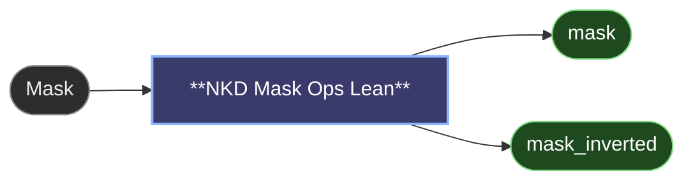

# 😺NKD Mask Ops Lean

The three mask tweaks a composite actually needs, Fill Holes, Expand / Contract
and Feather, without the rest of the panel on screen. Same engine as Mask Ops,
same speed, three widgets.

That speed is the point, and the difference isn't small. Growing or feathering a
mask is usually done frame by frame on the CPU, one pixel of growth per pass,
which is why it quietly becomes the slow step of a video graph. Here the whole
batch makes a single trip to the GPU and the radius is nearly free: expand by 200
px and it costs about the same as expanding by 8.

Expand + feather on 1080p, RTX 5090, against the usual per-frame CPU
implementation:

| | Lean | usual CPU node |
|---|---|---|
| 1 frame, grow 8, feather 4 | **3.7 ms** | 133 ms |
| 1 frame, grow 32, feather 16 | **3.4 ms** | 410 ms |
| 1 frame, grow 200, feather 16 | **4.3 ms** | 2.5 s |
| 81 frames, grow 8, feather 4 | **0.35 s** | 10.5 s |
| 81 frames, grow 32, feather 16 | **0.24 s** | 32 s |
| 81 frames, grow 200, feather 16 | **0.31 s** | 3.6 min |

Single image or 81 frames, same node.

Reach for the full [😺NKD Mask Ops](mask-ops.md) when you need levels, speck
removal, gap closing, blockify or the temporal steps.

---

[← All 😺NKD Basic Tools nodes](../README.md)
