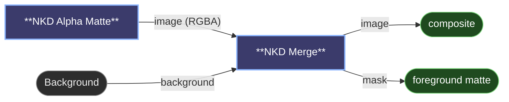

# 😺NKD Merge

Puts a transparent cut-out over a background, frame by frame, and lets you place
it by dragging it around in the node. A still background under a video cut-out
works, and so does the other way round.

The core has compositing nodes, but none of them handles video. Porter-Duff
Image Composite trims the result to its shortest input, so a single background
frame under an 81-frame cut-out gives you one frame. Image Composite Masked
ignores the cut-out's own alpha and can't place it past the top or left edge.
Create Layered Image stacks a batch as layers instead of playing it as frames.

## Placing the foreground

Run the graph once and both inputs show up in the node: the background, with the
foreground on top inside a blue frame. Anything outside the background is dimmed,
because the render crops it.

- Drag inside the frame to move it. Its centre and edges stick to the background's
  centre lines and edges when they get close; hold `Alt` to turn that off.
- Drag a corner to scale. It scales about the centre, keeping the proportions.
- Drag the round knob above the top edge to rotate. Hold `Shift` to step in 15°,
  and double-click the knob to straighten it.
- Hold `Shift` while moving or scaling for tenth-speed fine adjustment.
- The bar on top shows the centre in background pixels, the scale and the angle,
  and you can type any of them. `Center` puts the foreground back in the middle;
  `Reset` also clears scale and rotation.
- For a video, the scrub bar under the picture steps through a dozen frames of the
  clip, so you can check the framing holds for the whole shot.
- `Hide preview`, the wide button above the bar, folds the picture away to save
  space. The numbers stay, and the node remembers which way you left it.

The placement is stored relative to the background, not in pixels, so swapping
the background for a bigger or smaller version of the same shot keeps the
foreground where you put it.

## Settings

- `background` is an image or frames, and sets the output size.
- `foreground` is the cut-out, RGBA as Alpha Matte makes it. An RGB image counts as fully opaque.
- `alpha` is optional: a matte for the foreground, 1 = opaque. It replaces the foreground's own alpha.
- `fit` decides what a scale of 100% means. With fit the whole foreground fits inside the background, with fill it covers it and the overflow is cropped, and with pixels it keeps its own size. A cut-out from the same shot at another resolution lines up on its own with fit.
- `opacity` fades the whole foreground.
- `blend_mode` offers the same modes as Create Layered Image.

The `image` output has as many frames as the longer input, and the shorter one
loops. It's RGBA only when the background was, so a transparent background stays
transparent when saved with 😺NKD Video Viewer (ProRes 4444 or webm/vp9). The
`mask` output is the foreground's matte where it landed, for working on the
subject alone afterwards.

Blending uses the core's own engine, the one behind Create Layered Image, so a
mode looks the same in both. Colours are mixed in linear light, which is why a
50% black over white comes out lighter than a 0.5 grey would suggest. Normal runs
on the GPU; the other modes go through the core's CPU code and take roughly a
second per 1080p frame.

---

[← All 😺NKD Basic Tools nodes](../README.md)
