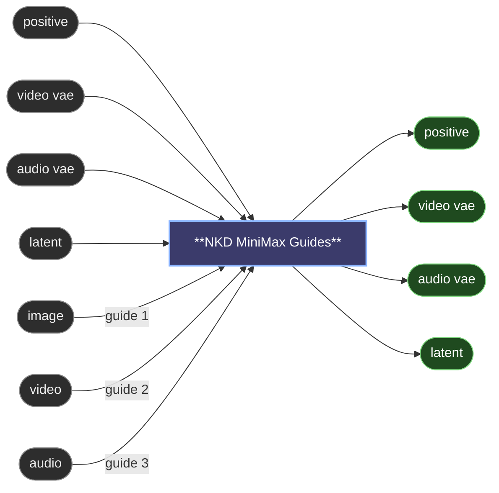

# 😺NKD MiniMax Guides

Anchors every guide of a MiniMax H3 shot from one node, instead of a row of **Add
Guide for MiniMax H3** nodes each dragging the same four cables in from far
upstream. Move one and the canvas turns to spaghetti.

- **The guide list grows as you fill it.** Each slot takes a still, a frame
  sequence, a video (picture and its soundtrack) or bare audio.
- **A `position` widget** appears next to each filled slot, for the frame it
  lands on. Negative positions count from the end.
- **Two slots on the same position**, a clip and its sound, become one guide.
- **`latent`, `video vae` and `audio vae` come straight back out**, so the
  sampler and whatever comes next hang off this node instead of reaching back
  across the graph. Both VAEs are required inputs rather than optional ones,
  which keeps them at the top of the node, above the guide list that grows.

The anchoring itself is the core node's: same clip-length snapping, same audio
cropping, same errors.

---

[← All 😺NKD Basic Tools nodes](../README.md)
