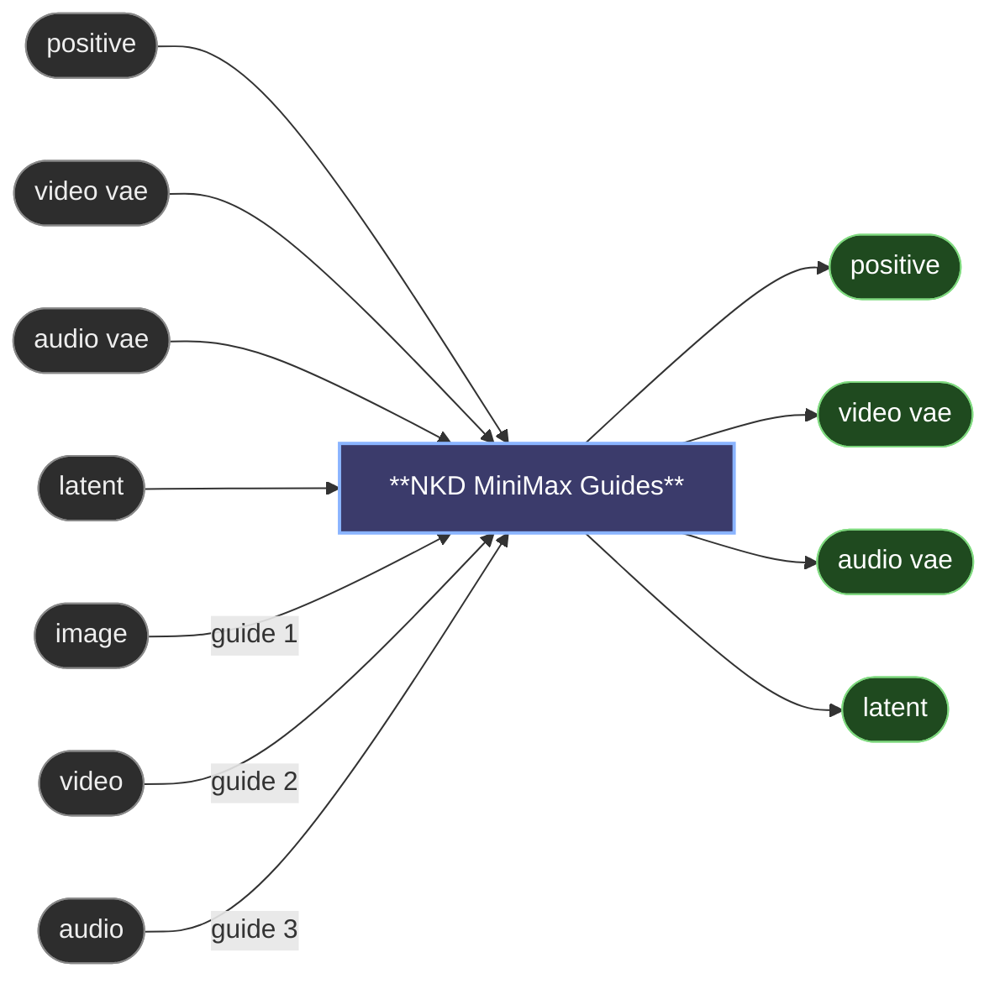

# 😺NKD MiniMax Guides

Anchors every guide of a MiniMax H3 shot from one node, instead of a row of **Add
Guide for MiniMax H3** nodes each dragging the same four cables in from far
upstream. Move one and the canvas turns to spaghetti.

```mermaid
flowchart LR
    POS(["positive"]):::input --> MG
    VV(["video vae"]):::input --> MG
    AA(["audio vae"]):::input --> MG
    LAT(["latent"]):::input --> MG
    IMG(["image"]):::input -- guide 1 --> MG
    VID(["video"]):::input -- guide 2 --> MG
    AUD(["audio"]):::input -- guide 3 --> MG
    MG["**NKD MiniMax Guides**"]:::nkd --> O1(["positive"]):::output
    MG --> O2(["video vae"]):::output
    MG --> O3(["audio vae"]):::output
    MG --> O4(["latent"]):::output

    classDef nkd fill:#3b3b6b,stroke:#8ab4ff,stroke-width:2px,color:#fff
    classDef input fill:#2d2d2d,stroke:#888,color:#eee
    classDef output fill:#1f4a1f,stroke:#7fd97f,color:#fff
```

- **The guide list grows as you fill it.** Each slot takes a still, a frame
  sequence, a video (picture and its soundtrack) or bare audio.
- **A `position` widget** appears next to each filled slot, for the frame it
  lands on. Negative positions count from the end.
- **Two slots on the same position**, a clip and its sound, become one guide.
- **`snap positions` keeps every guide on a multiple of 17.** H3's time axis is not
  uniform: a video token covers 1, 4, 4, 4, 4 pixel frames in turn, so token starts
  fall on frames 17m, 17m+1, 17m+5, 17m+9, 17m+13 — while a guide's own latent is
  always cut from the start of that cycle. The two line up only on a **multiple of
  17** (0, 17, 34, 51, 68, 85, 102, 119…). Anywhere else the guide's rows land
  between the video's tokens, and that frame flashes like a cut in the wrong place.
  On by default; turn it off to place a guide by hand and own the result.
- **`position -1` is the end anchor**, the video's very last frame — where `fl2va`
  puts its own closing keyframe, and the one place off the grid the model was
  trained on, so snapping never moves it. Drop the opening image there and the shot
  loops. Any negative counts back from the end the same way.
- **`latent`, `video vae` and `audio vae` come straight back out**, so the
  sampler and whatever comes next hang off this node instead of reaching back
  across the graph. Both VAEs are required inputs rather than optional ones,
  which keeps them at the top of the node, above the guide list that grows.

The anchoring itself is the core node's: same clip-length snapping, same audio
cropping, same errors.

---

[← All 😺NKD Basic Tools nodes](../README.md)
