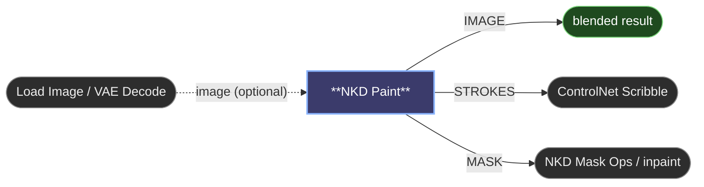

# 😺NKD Paint

A brush on the node itself. Connect an image and it shows up behind the canvas at
its own resolution; connect nothing and you get a blank canvas of the size you set.
Paint, scribble, block in a contrast, erase, and the result comes out three ways at
once: blended over the image, as the strokes alone, and as a mask of exactly what
you touched. The node exists so a quick scribble for ControlNet doesn't need a
trip to an external editor.

## Inputs

- `image` (optional). Sets the canvas size and shows behind the strokes. A Load
  Image wired straight in appears at once. Anything else, a crop, a resize or a VAE
  Decode, shows what it really produces after the first run, so the node runs on
  its own when you press Run, with nothing connected downstream.
- `width`, `height`: canvas size when no image is connected. Hidden while one is.
  Default 1024 × 1024, 64 to 4096 in steps of 8.
- `bg_color`: the background under the strokes in the STROKES output, and of the
  blank canvas when there's no image. Default black.
- `controlnet`: scribble mode. The brush is always white and STROKES is white on
  black, whatever colour the layer was painted in. Off by default.

## Outputs

- `IMAGE`: the strokes blended over the base, at the base's resolution.
- `STROKES`: the strokes alone over `bg_color`. In `controlnet` mode, white on
  black, ready for a Scribble ControlNet.
- `MASK`: the alpha of the strokes. Partial opacity stays partial.

## Painting

- `Brush` and `Eraser` buttons, or `B` and `E`.
- The colour swatch opens a picker. Two quick swatches sit next to it for white
  and black, and `X` swaps between them.
- `Alt` + left click picks the colour under the cursor, image and strokes
  together.
- `Alt` + right drag is the Photoshop gesture: left and right change the size, up and
  down change the hardness (down hardens). The ring shows both while you drag. `[`
  and `]` step the size down and up.
- `Size`, `Opacity` and `Hard` sliders. Opacity applies to the whole stroke when
  you release, so a stroke never builds up on itself. Hardness goes from a soft
  airbrush to a solid edge.
- `Base` dims the image behind the canvas, so a dark scribble reads over a dark
  photo. It's only for looking; the outputs ignore it.
- `Shift` while dragging any slider moves it at a tenth of the speed.
- A pen's pressure scales the brush size.
- `Ctrl+Z` undoes, `Ctrl+Shift+Z` or `Ctrl+Y` redoes. `Clear` wipes the layer.
- Mouse wheel zooms at the cursor, `Space` + drag or the middle button pans, `0`
  fits the canvas again.

## Where the strokes live

Each time you finish a stroke the layer is saved as a PNG under
`ComfyUI/input/nkd_paint/`, and only that filename is stored in the workflow. The
name is a hash of the picture, so an unchanged layer is a cache hit and the graph
doesn't re-run the node. It also means the drawing travels with the ComfyUI
install, like a Load Image file, not inside the workflow JSON. Old layers you no
longer reference stay in that folder until you delete them.

---

[← All 😺NKD Basic Tools nodes](../README.md)
